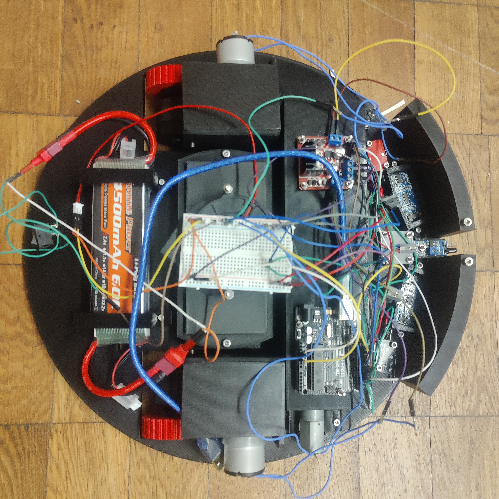
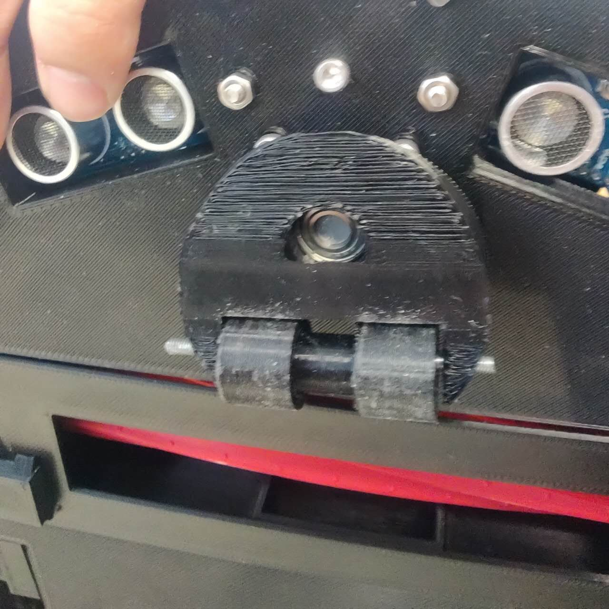
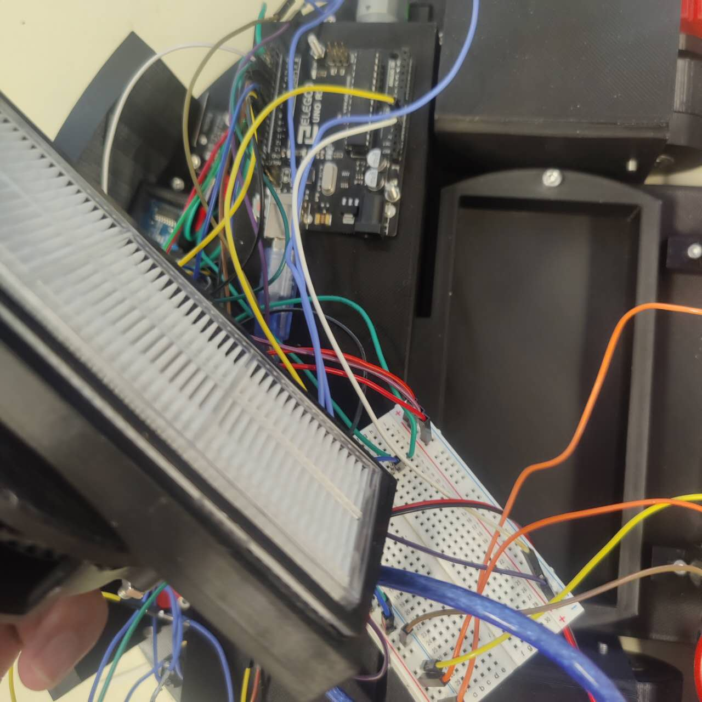

# 扫地机器人开发与构建 (Vacuum Cleaning Robot Development)

[](https://github.com/1062270094zsl-cloud/vacuum-cleaning-robot)
[](LICENSE)

## 📋 项目概述

**项目名称：** 扫地机器人开发与构建  
**英文名称：** Vacuum Cleaning Robot Development  
**时间：** 2023.03 -- 2023.08  
**角色：** 课题负责人

研究吸尘器发展史，分析商用模型，自主设计扫地机器人。

## 🛠️ 技术栈

机械设计 | 3D打印 | 单片机控制

## 🎯 主要工作

1. 完成机器人结构设计与 3D 打印组装
2. 基于单片机编写运动与避障程序，实现自主移动
3. 多轮实验优化避障策略，提高运行效率和稳定性

## 📊 量化成果

系统在室内环境下稳定完成清扫任务，覆盖率达 90%+

## 📁 项目结构

```
vacuum-cleaning-robot/
├── README.md
├── LICENSE
├── docs/
│   ├── presentation/
│   │   └── Staubsaugroboter.pptx    # 项目演示PPT
│   └── papers/
│       ├── Bachelorarbeit.pdf       # 学士论文
│       └── Expose.pdf               # 项目说明文档
└── assets/
    ├── images/                      # 项目图片 (7张)
    ├── videos/                      # 演示视频 (9个)
    └── gifs/                        # 动画演示 (2个)
```

## 📸 项目资源

### 演示文稿
- **PPT文件**: [`docs/presentation/Staubsaugroboter.pptx`](docs/presentation/Staubsaugroboter.pptx)
  - 包含项目完整介绍、设计思路、实现过程和成果展示

### 学术文档
- **学士论文**: [`docs/papers/Bachelorarbeit.pdf`](docs/papers/Bachelorarbeit.pdf)
- **项目说明**: [`docs/papers/Expose.pdf`](docs/papers/Expose.pdf)

### 项目图片
- **图片资源**: [`assets/images/`](assets/images/)
  - 包含机器人设计图、组装过程、测试场景等照片 (7张)

#### 图片展示
<div align="center">
  
  
  
  
  
  
  
</div>

### 演示视频
- **视频资源**: [`assets/videos/`](assets/videos/)
  - 包含机器人运行演示、测试过程等视频 (9个)

#### 视频列表
- [视频1: 机器人运行演示](assets/videos/1.mp4)
- [视频2: 避障测试](assets/videos/2.mp4)
- [视频3: 清扫路径演示](assets/videos/3.mp4)
- [视频4: 完整工作流程](assets/videos/4.mp4)
- [视频5: 传感器测试](assets/videos/d52e898291ee71481d371558fb24f327.mp4)
- [视频6: 性能测试](assets/videos/f7b5ca9e1396da264e2b6a166f6e515d.mp4)
- [视频7: 商业模型对比](assets/videos/heros-s7-roborock-s7-all-new-all-rubber-brush.mp4)
- [视频8: 制作过程](assets/videos/无标题视频——使用Clipchamp制作.mp4)

### 动画演示
- **GIF资源**: [`assets/gifs/`](assets/gifs/)
  - 包含机器人工作流程动画演示 (2个)

#### GIF展示
<div align="center">
  
  
</div>

## 🚀 快速开始

```bash
# 克隆仓库
git clone https://github.com/1062270094zsl-cloud/vacuum-cleaning-robot.git
cd vacuum-cleaning-robot

# 查看项目文档
# 打开 docs/presentation/Staubsaugroboter.pptx 查看演示文稿
# 查看 docs/papers/ 目录下的学术文档
# 查看 assets/ 目录下的图片、视频和动画资源
```

## 📄 许可证

This project is licensed under the MIT License.

## 👤 作者

**Shili Zhang** - [GitHub](https://github.com/1062270094zsl-cloud)

## 🔗 相关链接

- [Portfolio](https://github.com/1062270094zsl-cloud/1062270094zsl-cloud)
- [其他项目](https://github.com/1062270094zsl-cloud?tab=repositories)

---

**最后更新：** 2025年1月
